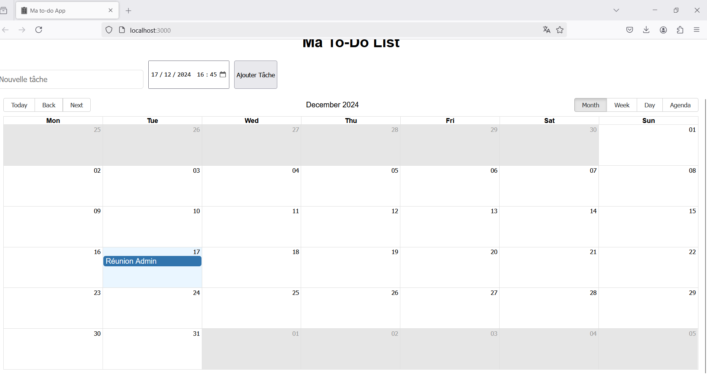
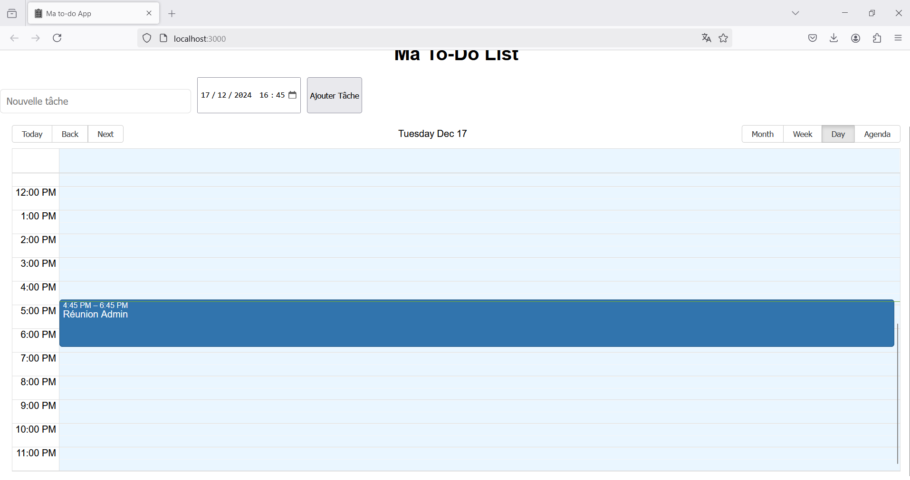
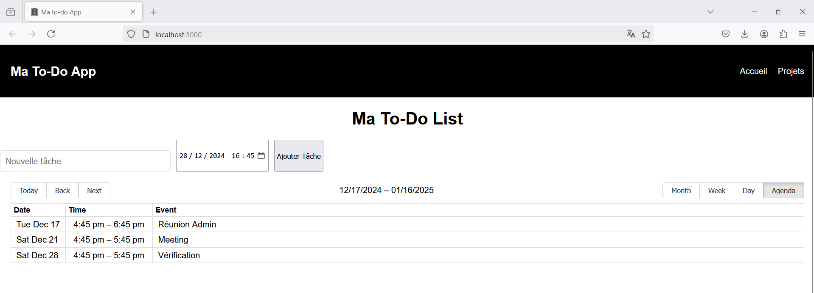
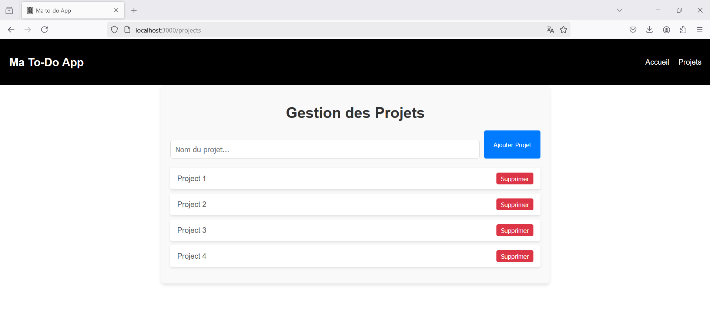

# To-Do App 📝

Une application web moderne pour gérer vos tâches et projets. Organisez vos activités de manière simple et efficace grâce à des fonctionnalités comme l'ajout de tâches, l'affichage d'un calendrier interactif, et bien plus encore.

## Fonctionnalités 🚀

- **Ajout de tâches** : Créez rapidement des tâches avec un titre et une date de début.
- **Calendrier interactif** : Visualisez vos tâches sur un calendrier pour mieux organiser votre emploi du temps.
- **Modification et suppression de tâches** : Modifiez les détails ou supprimez des tâches en quelques clics.
- **Gestion de projets** : Créez des projets et ajoutez des tâches associées à chacun d'eux.

## Technologies utilisées 🔧

- **React.js** : Librairie JavaScript pour construire l'interface utilisateur.
- **React Router** : Pour gérer la navigation entre les pages.
- **react-big-calendar** : Un composant de calendrier interactif pour afficher les tâches.
- **date-fns** : Librairie pour manipuler et formater les dates.
- **Modal** : Pour afficher des fenêtres modales permettant la gestion des tâches.

## Installation 🛠️

1. Clonez ce repository :
    ```bash
    git clone https://github.com/GabrielBDN/To-do-App.git
    ```

2. Naviguez dans le dossier du projet :
    ```bash
    cd to-do-app
    ```

3. Installez les dépendances :
    ```bash
    npm install
    ```

4. Démarrez l'application :
    ```bash
    npm start
    ```

    L'application sera accessible à l'adresse [http://localhost:3000](http://localhost:3000).

## Captures d'écran 📸

Voici quelques captures d'écran de l'application :






## Contribuer 🤝

1. Fork ce repository.
2. Créez une branche (`git checkout -b ma-nouvelle-fonctionnalite`).
3. Commitez vos changements (`git commit -m 'Ajout de nouvelle fonctionnalité'`).
4. Poussez sur votre branche (`git push origin ma-nouvelle-fonctionnalite`).
5. Ouvrez une pull request.

## Auteurs ✨

- **Gabriel BEDUNEAU** - *Développeur principal* - [GabrielBDN](https://github.com/GabrielBDN)
